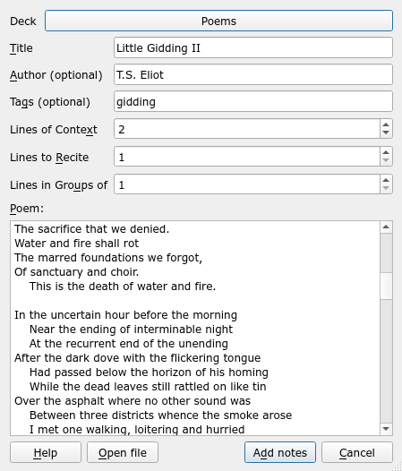
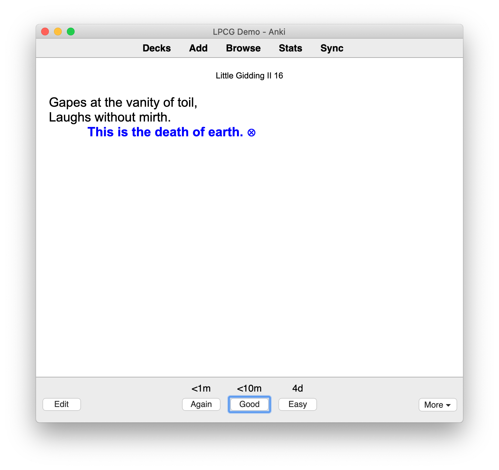
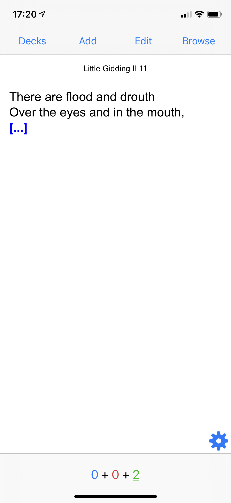

Anki **Lyrics/Poetry Cloze Generator** (LPCG) is an add-on for [Anki][]
to make it easier to study long passages of verbatim text,
like poetry or song lyrics.

LPCG is licensed under the GNU AGPL version 3,
or at your option, any later version.

## How do I...

* **Install LPCG**: Visit its [AnkiWeb page][awp].
* **Use LPCG**: Visit the [documentation on Read the Docs][doc].
* **Get help with LPCG**: See the [getting help][] section of the documentation.
* **Contribute to LPCG**:
  Post on the `Issues` tab of this repository, or submit a pull request.
* **See what's changed**:
  See the [changelog][] page of the documentation.

[Anki]: https://apps.ankiweb.net
[awp]: https://ankiweb.net/shared/info/2084557901
[doc]: https://ankilpcg.readthedocs.io/en/latest/index.html
[getting help]: https://ankilpcg.readthedocs.io/en/latest/index.html#getting-help
[changelog]: https://ankilpcg.readthedocs.io/en/latest/changes.html

## Screenshots

